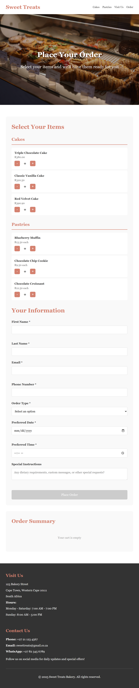
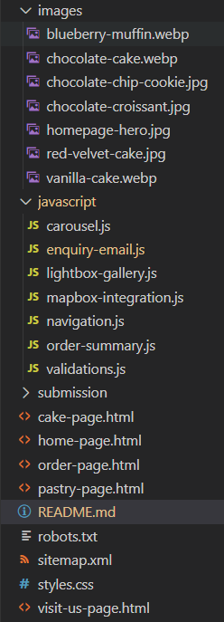

# 🧁 Sweet Treats Bakery - Frontend

> Module: Web Development (Introduction) - WEDE5020

> Student Name: Michael-John Uren

> Student Number: ST10465421

[](https://developer.mozilla.org/en-US/docs/Web/HTML)
[](https://developer.mozilla.org/en-US/docs/Web/CSS)

## Website View


## iPad Mini View




## 📖 Table of Contents

- [About](#about)
- [Goals of Website](#goals-of-website)
- [Features](#features)
- [Timelines and Milestones](#timeline-and-milestones)
- [Sitemap](#sitemap)
- [Project Structure](#project-structure)
- [Change Log](#change-log)
- [Navigation](#-usage)
- [References](#references)
- [Contact](#contact)

## About

Sweet Treats Bakery is a fully responsive frontend web application designed for a local artisan bakery. The project showcases modern web development practices using HTML5 and CSS, featuring an elegant user interface that highlights the bakery's products, services, and brand story.

The project consists of:
- Home Page
- Pastry Page
- Cake Page
- Visit Us Page
- Order Page

- **Project Type:** School Project - Frontend Development
- **Project Goals:** HTML5 structure, CSS styling, and Version Control (GitHub)
- **Due:** 3rd October 2025
- **Status:** ✅ Completed

## 🎯 Goals of Website

- **Increase Brand Visibility** Establish a strong online presence to reach customers beyond foot traffic
- **Drive Sales** Enable online ordering and increase overall revenue 
- **Customer Engagement** Build a community around the bakery's brand and values 
- **Operational Efficiency** Reduce phone orders and in-store wait times through online ordering
- **Improve Product Marketing** Showcase seasonal menus and special offerings effectively 
- **Contact Form** Provide easy access to contact information and location details

## ✨ Features

### 🏠 Home Page

- **Hero Section** with bakery branding and call-to-action
- **Daily Specials Carousel** showcasing featured items
- **Store Information** including hours and location
- **Contact Form** for customer inquiries

### 🍞 Product Pages

- **Pastries** - Croissants, muffins, and Chocolate chip cookies 
- **Cakes** - Chocolate, Vanilla, and Red Velvet
- Detailed product descriptions and high-quality images

### 🛒 Order Management

- **Online Ordering** system with intuitive interface
- **Product Selection** with quantity controls
- **Order Summary** with calculated prices and items selected
- **Contact Integration** for order confirmation

### 📱 User Experience

- **Fully Responsive Design** - Mobile, tablet, and desktop optimized
- **Modern UI/UX** with clean, bakery-themed aesthetics
- **Fast Loading** with optimized images and code
- **Accessible Design** following web accessibility standards

## ⏳ Timeline and Milestones

### Phase 1: Planning and Design (Weeks 1-3)
- **Week 1** - Requirements gathering and content strategy
- **Week 2** - Wireframes and design mockups
- **Week 3** - Design approval and content creation

### Phase 2: Development  (Weeks 4-7)
- **Week 4**   - Homepage and basic structure setup
- **Week 5-6** - Product catalog and ordering system development
- **Week 7**   - Additional features and functionality integration

### Phase 3: Testing and Launch (Weeks 8-10)
- **Week 8**  - Content population and internal testing
- **Week 9**  - User acceptance testing and bug fixes
- **Week 10** - Final review, launch, and post-launch monitoring

## 🗺️ Site Map

```
Home 
 ├── Products
 │     ├── Pastries Page
 │     │      └── Order Page 
 │     └── Cake Page
 │            └── Order Page
 └── Visit Us
 |__ Order Page

```

## 📁 Project Structure



## 👨🏻‍💻 Change Log

### Week 1-2

- Add Home Page HTML with Hero section, daily specials, and footer with location and contact details

- Add Pastry Page HTML with hero section, grid for three products, and footer with location and contact details

- Add Cake Page HTML with hero section, grid for three products, and footer with location and contact details

- Add Visit Us Page with hero section, grid for info section, map section with map container for map integration, and footer with location and contact details

- Add Order Page with hero section, order form with product selection, customer detail form, order summary section, and footer with location and contact details

### Week 3-5

- Add with HTML, CSS, and images for the hero and carousel sections to Home Page

- Add  HTML, CSS, and images for hero section and product descriptions to Pastry Page

- Add  HTML, CSS, and images for hero section and product descriptions to Cake Page

- Add  HTML, CSS, and image for hero section to Visit Page

- Add  HTML, CSS, and image for hero section to Order Page

- Updated project structure

## 📍Navigation

- **Home:** Landing page with overview and daily specials
- **Pastries:** Explore pastry and dessert offerings  
- **Cakes:** View cake gallery and ordering information
- **Visit Us:** Location and contact details of bakery
- **Order:** Place orders and contact the bakery

## 📋 References

- [1] Lepard, C. (2020). 5 web design tips for an outstanding site. [online] Wix Blog. 
Available at: https://www.wix.com/blog/5-design-tips-for-a-professional-site.

- [2] New Perspective Design (2021). What is the Cost of Creating a Website in South Africa? | How much does of a website design in South Africa. [online] New Perspective Design | Graphic & Web Design East London. 
Available at: https://www.newperspectivestudio.co.za/wp/what-is-the-cost-of-creating-a-website-in-south-africa/.

- [3] Domains South Africa. (2020). Guide To Cost Of Hosting A Website In South Africa (Table) (2025). [online] 
Available at: https://truehost.co.za/cost-of-hosting-website-south-africa/.

- [4] Bunnypants Graphic & Web Design Studio South Africa. (n.d.). | How much does web hosting cost in South Africa. [online] 
Available at: https://www.bunnypants.co.za/how-much-does-web-hosting-cost-in-south-africa/.

- [5] Williams, J. (2005). business - The Basics of Branding. [online] Entrepreneur. 
Available at: https://www.entrepreneur.com/starting-a-business/business-the-basics-of-branding/77408.

- [6] Orgil, E. (2023). Pricing Strategy. [online] DealHub. Available at: https://dealhub.io/glossary/pricing-strategy/.

- ‌[7] Flowsa.com. (2024). Picture this! Ten tips for sourcing images ethically without landing in a pickle. [online] 
Available at: https://www.flowsa.com/news/picture-this-ten-tips-for-sourcing-images-ethically-without-landing-in-a-pickle

## 🎓 Learning Objectives

This project demonstrates proficiency in:

- ✅ **Responsive Web Design** - Mobile-first development
- ✅ **CSS Grid & Flexbox** - Modern layout techniques
- ✅ **User Experience Design** - Intuitive navigation and interactions
- ✅ **Project Organization** - Clean code structure and documentation

## 📬 Contact

**Student:** Michael-John Uren (ST10465421) 
**Email:** michael16.uren@gmail.com  
**Course:** Introduction to Web Development (WEDE5020) 
**Institution:** Rosebank College

---
