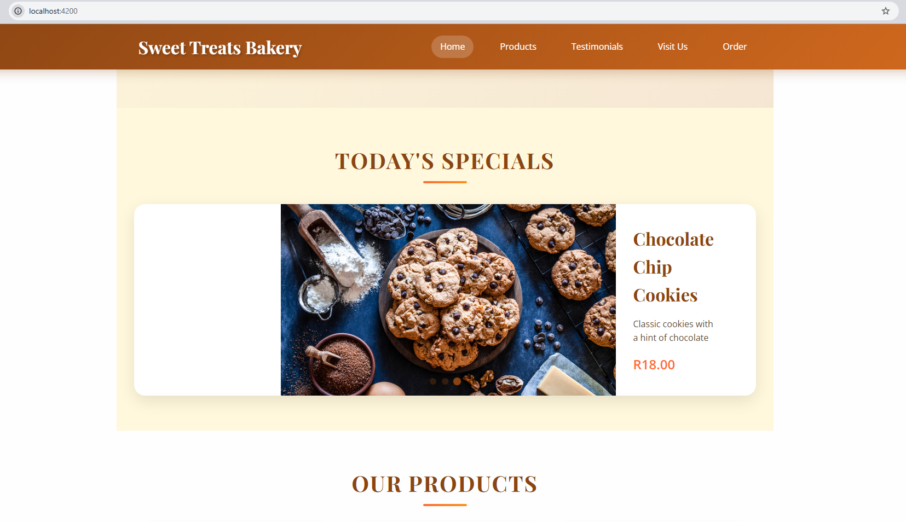
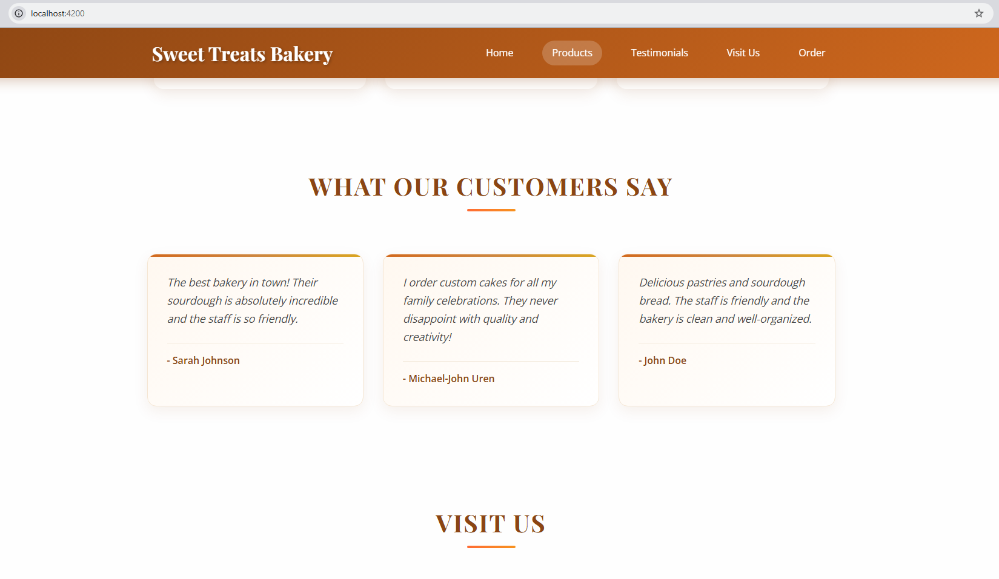
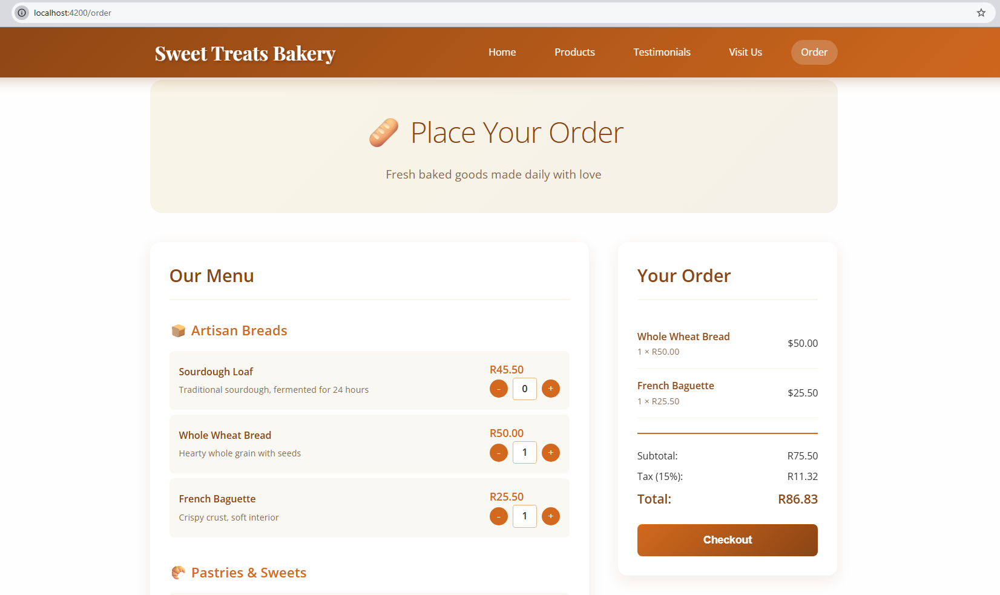
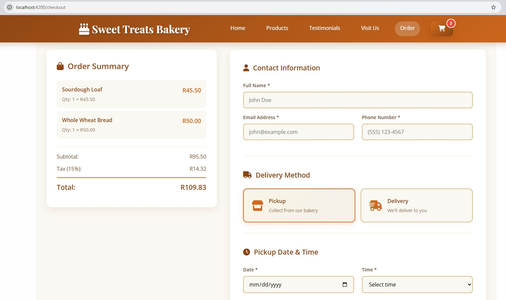
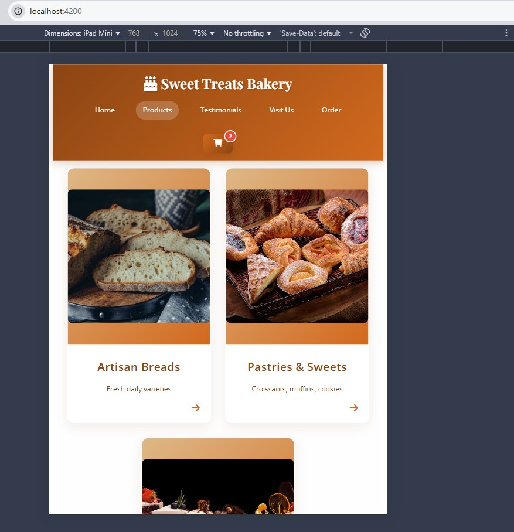
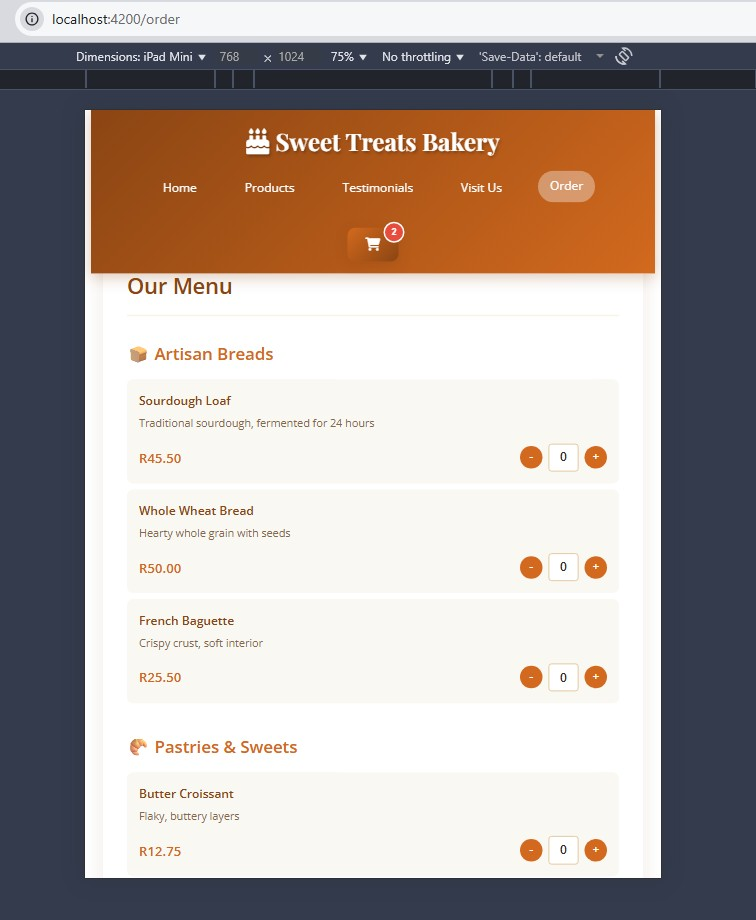
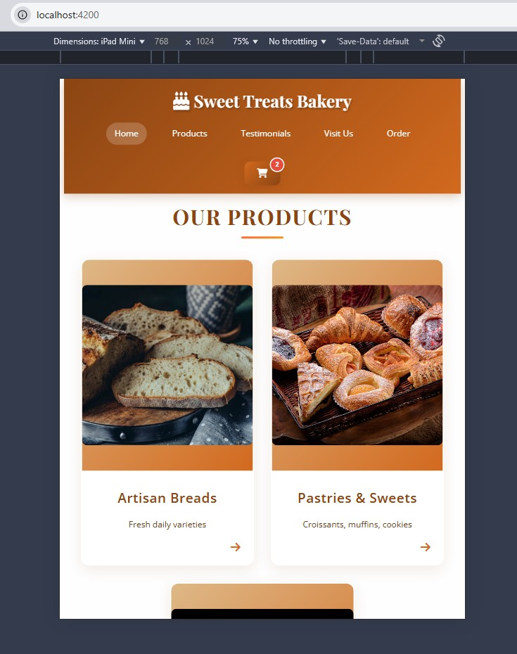

# 🧁 Sweet Treats Bakery - Frontend

> A modern, responsive web application for a local artisan bakery built with Angular

[](https://angular.io/)
[](https://www.typescriptlang.org/)
[](https://developer.mozilla.org/en-US/docs/Web/HTML)
[](https://developer.mozilla.org/en-US/docs/Web/CSS)

## Website View







	
	

## iPad Mini View
	
	
	

## 📖 Table of Contents

- [About](#about)
- [Goals of Website](#goals-of-website)
- [Features](#features)
- [Timelines and Milestones](#timeline-and-milestones)
- [Sitemap](#sitemap)
- [Screenshots](#screenshots)
- [Tech Stack](#tech-stack)
- [Getting Started](#getting-started)
- [Project Structure](#project-structure)
- [Change Log](#change-log)
- [Usage](#-usage)
- [References](#references)
- [Contact](#contact)

## About

Sweet Treats Bakery is a fully responsive frontend web application designed for a local artisan bakery. The project showcases modern web development practices using Angular framework, featuring an elegant user interface that highlights the bakery's products, services, and brand story.

- **Project Type:** School Project - Frontend Development
- **Due:** 3rd October 2025
- **Status:** ✅ Completed

## 🎯 Goals of Website

- **Increase Brand Visibility** Establish a strong online presence to reach customers beyond foot traffic
- **Drive Sales** Enable online ordering and increase overall revenue 
- **Customer Engagement** Build a community around the bakery's brand and values 
- **Operational Efficiency** Reduce phone orders and in-store wait times through online ordering
- **Improve Product Marketing** Showcase seasonal menus and special offerings effectively 
- **Contact Form** Provide easy access to contact information and location details

## ✨ Features

### 🏠 Home Page

- **Hero Section** with bakery branding and call-to-action
- **Daily Specials Carousel** showcasing featured items
- **Product Categories** overview with navigation
- **Customer Testimonials** section
- **Store Information** including hours and location
- **Contact Form** for customer inquiries

### 🍞 Product Pages

- **Artisan Breads** - Sourdough, multigrain, specialty loaves
- **Pastries & Desserts** - Croissants, muffins, seasonal treats  
- **Custom Cakes** - Wedding cakes, birthday cakes, special orders
- Detailed product descriptions and high-quality images

### 🛒 Order Management

- **Online Ordering** system with intuitive interface
- **Product Selection** with quantity controls
- **Order Summary**
- **Contact Integration** for order confirmation

### 📱 User Experience

- **Fully Responsive Design** - Mobile, tablet, and desktop optimized
- **Modern UI/UX** with clean, bakery-themed aesthetics
- **Fast Loading** with optimized images and code
- **Accessible Design** following web accessibility standards

## ⏳ Timeline and Milestones

### Phase 1: Planning and Design (Weeks 1-3)
- **Week 1** - Requirements gathering and content strategy
- **Week 2** - Wireframes and design mockups
- **Week 3** - Design approval and content creation

### Phase 2: Development  (Weeks 4-7)
- **Week 4**   - Homepage and basic structure setup
- **Week 5-6** - Product catalog and ordering system development
- **Week 7**   - Additional features and functionality integration

### Phase 3: Testing and Launch (Weeks 8-10)
- **Week 8**  - Content population and internal testing
- **Week 9**  - User acceptance testing and bug fixes
- **Week 10** - Final review, launch, and post-launch monitoring

## 🗺️ Site Map

```
Home 
 ├── Products
 │     ├── Bread Page
 │     │      └── Order Page → Checkout Page
 │     ├── Pastries Page
 │     │      └── Order Page → Checkout Page
 │     └── Cake Page
 │            └── Order Page → Checkout Page
 ├── Testimonials
 └── Visit Us

```

## 🛠️ Tech Stack

**Frontend Framework:**
- **Angular** (v16+) - Component-based architecture
- **TypeScript** - Type-safe JavaScript development
- **Angular CLI** - Development tooling

**Styling & UI:**
- **CSS** - Custom styling and animations
- **Google Fonts** - Typography (Poppins, Open Sans)
- **Responsive Design** - Mobile-first approach

**Development Tools:**
- **Node.js** - Runtime environment
- **npm** - Package management
- **Angular DevKit** - Build optimization

## 🚀 Getting Started

### Prerequisites

Before running this project, make sure you have the following installed:

- **Node.js** (v18.0 or later) - [Download here](https://nodejs.org/)
- **npm** (comes with Node.js)
- **Angular CLI** (v16.0 or later)

```bash
# Install Angular CLI globally
npm install -g @angular/cli@latest
```

### Installation

1. **Clone the repository**
   ```bash
   git clone https://github.com/michaeljuren/sweet-treats-bakery-fe.git
   cd sweet-treats-bakery-fe
   ```

2. **Install dependencies**
   ```bash
   npm install
   ```

3. **Start the development server**
   ```bash
   ng serve
   ```

4. **Open your browser**
   ```
   Navigate to http://localhost:4200/
   ```

The application will automatically reload when you make changes to the source files.

## 📁 Project Structure

```
sweet-treats-bakery-fe/
├── src/
│   ├── app/
│   │   ├── components/
│   │   │   ├── breads/
│   │   │   ├── cakes/
│   │   │   ├── pastries/
│   │   │   ├── carousel/
│   │   │   └── ...
│   │   ├── interfaces/
│   │   ├── services/
│   │   ├── app.component.*
│   │   ├── app.config.ts
│   │   └── app.routes.ts
│   ├── assets/
│   │   └── images/
│   ├── main.ts
│   └── styles.css
├── angular.json
├── package.json
└── README.md
```

## 👨🏻‍💻 Change Log

### Week 1-2

- Add Home component with Hero section, daily specials, products, testimonials, and location details

- Add Interfaces for Daily specials, Products, Testimonials, Contact Information, Store Hours and Product Categories

- Add Carousal component with HTML, CSS, and TypeScript files

- Add Order Page component with menu items, shopping cart functionality

- Add Location component with HTML, CSS, and TypeScript files

### Week 3-5

- Add Bread Component with HTML, CSS, TypeScript files, and images for artisan breads

- Add Pastery Component with HTML, CSS, TypeScript files, and images for various pastries

- Add Cakes Component with HTML, CSS, TypeScript files, and images for custom cakes

- Add configuration files and routing setup for application components

- Refactored App component with an updated layout and implemented the header with navigation and a footer

- Updated project structure

### Week 6-7

- Added Checkout component with HTML, CSS, TypeScript files, updated routing and interfaces

- Implemented cart service to manage cart items and calculate totals

- Refactored checkout and order page components to integrate cart service and enhanced item management

- Added a cart badge to the navigation menu

## 💻 Usage

### Navigation
- **Home:** Landing page with overview and daily specials
- **Breads:** Browse artisan bread selection
- **Pastries:** Explore pastry and dessert offerings  
- **Custom Cakes:** View cake gallery and ordering information
- **Order:** Place orders and contact the bakery

### Key Components

#### Daily Specials Carousel
```typescript
// Automatically rotates through featured items
// Includes product images, descriptions, and prices
// Click to navigate to full product pages
```

#### Product Display
```typescript  
// Grid layout showcasing bakery items
// Hover effects and detailed product cards
// Category filtering and search functionality
```

#### Responsive Design
```css
/* Mobile-first responsive breakpoints */
/* Tablet: 768px and up */
/* Desktop: 1024px and up */
/* Large screens: 1440px and up */
```

## 📋 References
- [1] Lepard, C. (2020). 5 web design tips for an outstanding site. [online] Wix Blog. 
Available at: https://www.wix.com/blog/5-design-tips-for-a-professional-site.

- [2] New Perspective Design (2021). What is the Cost of Creating a Website in South Africa? | How much does of a website design in South Africa. [online] New Perspective Design | Graphic & Web Design East London. 
Available at: https://www.newperspectivestudio.co.za/wp/what-is-the-cost-of-creating-a-website-in-south-africa/.

- [3] Domains South Africa. (2020). Guide To Cost Of Hosting A Website In South Africa (Table) (2025). [online] 
Available at: https://truehost.co.za/cost-of-hosting-website-south-africa/.

- [4] Bunnypants Graphic & Web Design Studio South Africa. (n.d.). | How much does web hosting cost in South Africa. [online] 
Available at: https://www.bunnypants.co.za/how-much-does-web-hosting-cost-in-south-africa/.

- [5] Williams, J. (2005). business - The Basics of Branding. [online] Entrepreneur. 
Available at: https://www.entrepreneur.com/starting-a-business/business-the-basics-of-branding/77408.

- [6] Orgil, E. (2023). Pricing Strategy. [online] DealHub. Available at: https://dealhub.io/glossary/pricing-strategy/.

- ‌[7] Flowsa.com. (2024). Picture this! Ten tips for sourcing images ethically without landing in a pickle. [online] 
Available at: https://www.flowsa.com/news/picture-this-ten-tips-for-sourcing-images-ethically-without-landing-in-a-pickle


## 🎓 Learning Objectives

This project demonstrates proficiency in:

- ✅ **Angular Framework** - Component architecture and routing
- ✅ **TypeScript** - Type safety and modern JavaScript features  
- ✅ **Responsive Web Design** - Mobile-first development
- ✅ **CSS Grid & Flexbox** - Modern layout techniques
- ✅ **User Experience Design** - Intuitive navigation and interactions
- ✅ **Project Organization** - Clean code structure and documentation


## 📬 Contact

**Student:** Michael-John Uren (ST10465421) 
**Email:** michael16.uren@gmail.com  
**Course:** Introduction to Web Development (WEDE5020) 
**Institution:** Rosebank College

---

