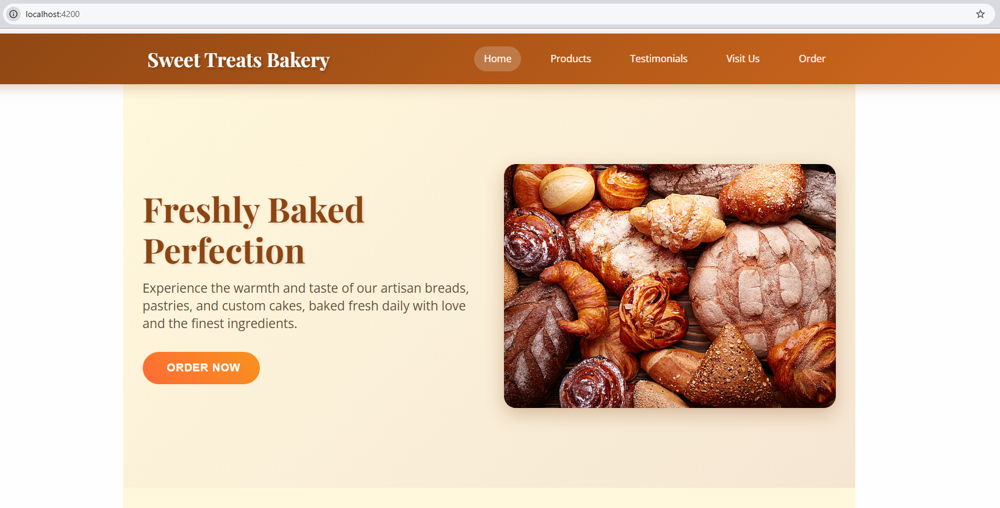
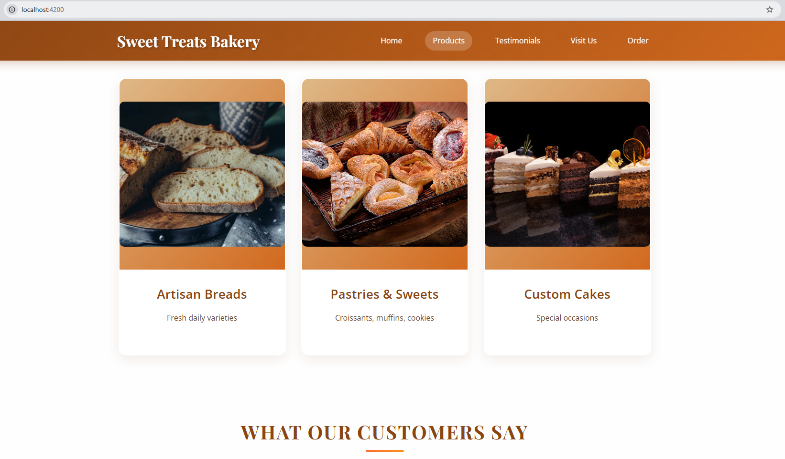
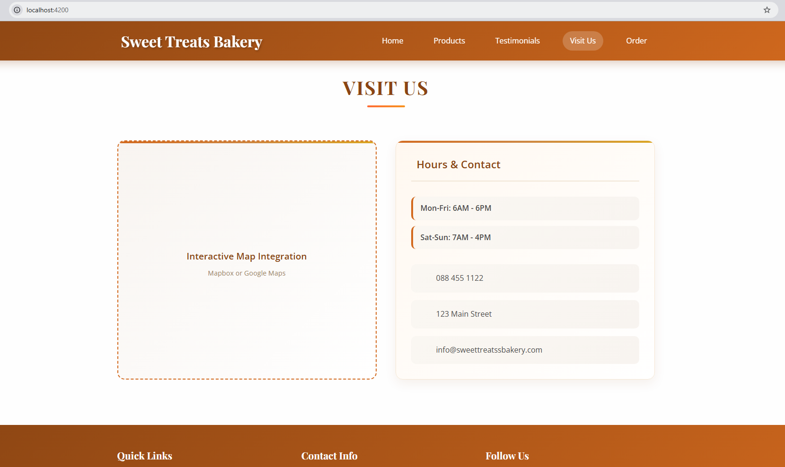
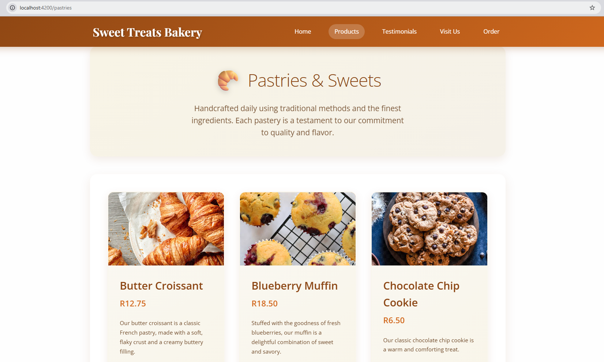

# 🧁 Sweet Treats Bakery - Frontend

> A modern, responsive web application for a local artisan bakery built with Angular

[](https://angular.io/)
[](https://www.typescriptlang.org/)
[](https://developer.mozilla.org/en-US/docs/Web/HTML)
[](https://developer.mozilla.org/en-US/docs/Web/CSS)







	

## 📖 Table of Contents

- [About](#about)
- [Features](#features)
- [Screenshots](#screenshots)
- [Tech Stack](#tech-stack)
- [Getting Started](#getting-started)
- [Project Structure](#project-structure)
- [Usage](#usage)
- [Contributing](#contributing)
- [License](#license)
- [Contact](#contact)

## 🎯 About

Sweet Treats Bakery is a fully responsive frontend web application designed for a local artisan bakery. The project showcases modern web development practices using Angular framework, featuring an elegant user interface that highlights the bakery's products, services, and brand story.

- **Project Type:** School Project - Frontend Development
- **Due:** 28 August 2025
- **Status:** ✅ Completed

## ✨ Features

### 🏠 Home Page

- **Hero Section** with bakery branding and call-to-action
- **Daily Specials Carousel** showcasing featured items
- **Product Categories** overview with navigation
- **Customer Testimonials** section
- **Store Information** including hours and location
- **Contact Form** for customer inquiries

### 🍞 Product Pages

- **Artisan Breads** - Sourdough, multigrain, specialty loaves
- **Pastries & Desserts** - Croissants, muffins, seasonal treats  
- **Custom Cakes** - Wedding cakes, birthday cakes, special orders
- Detailed product descriptions and high-quality images

### 🛒 Order Management

- **Online Ordering** system with intuitive interface
- **Product Selection** with quantity controls
- **Order Summary**
- **Contact Integration** for order confirmation

### 📱 User Experience

- **Fully Responsive Design** - Mobile, tablet, and desktop optimized
- **Modern UI/UX** with clean, bakery-themed aesthetics
- **Fast Loading** with optimized images and code
- **Accessible Design** following web accessibility standards

## 🛠️ Tech Stack

**Frontend Framework:**
- **Angular** (v16+) - Component-based architecture
- **TypeScript** - Type-safe JavaScript development
- **Angular CLI** - Development tooling

**Styling & UI:**
- **CSS3** - Custom styling and animations
- **Google Fonts** - Typography (Poppins, Open Sans)
- **Responsive Design** - Mobile-first approach

**Development Tools:**
- **Node.js** - Runtime environment
- **npm** - Package management
- **Angular DevKit** - Build optimization

## 🚀 Getting Started

### Prerequisites

Before running this project, make sure you have the following installed:

- **Node.js** (v18.0 or later) - [Download here](https://nodejs.org/)
- **npm** (comes with Node.js)
- **Angular CLI** (v16.0 or later)

```bash
# Install Angular CLI globally
npm install -g @angular/cli@latest
```

### Installation

1. **Clone the repository**
   ```bash
   git clone https://github.com/michaeljuren/sweet-treats-bakery-fe.git
   cd sweet-treats-bakery-fe
   ```

2. **Install dependencies**
   ```bash
   npm install
   ```

3. **Start the development server**
   ```bash
   ng serve
   ```

4. **Open your browser**
   ```
   Navigate to http://localhost:4200/
   ```

The application will automatically reload when you make changes to the source files.

### Build for Production

```bash
# Create production build
ng build --prod

# The build artifacts will be stored in the `dist/` directory
```

## 📁 Project Structure

```
sweet-treats-bakery-fe/
├── src/
│   ├── app/
│   │   ├── components/
│   │   │   ├── breads/
│   │   │   ├── cakes/
│   │   │   ├── pastries/
│   │   │   ├── carousel/
│   │   │   └── ...
│   │   ├── interfaces/
│   │   ├── services/
│   │   ├── app.component.*
│   │   ├── app.config.ts
│   │   └── app.routes.ts
│   ├── assets/
│   │   └── images/
│   ├── main.ts
│   └── styles.css
├── angular.json
├── package.json
└── README.md
```

## 💻 Usage

### Navigation
- **Home:** Landing page with overview and daily specials
- **Breads:** Browse artisan bread selection
- **Pastries:** Explore pastry and dessert offerings  
- **Custom Cakes:** View cake gallery and ordering information
- **Order:** Place orders and contact the bakery

### Key Components

#### Daily Specials Carousel
```typescript
// Automatically rotates through featured items
// Includes product images, descriptions, and prices
// Click to navigate to full product pages
```

#### Product Display
```typescript  
// Grid layout showcasing bakery items
// Hover effects and detailed product cards
// Category filtering and search functionality
```

#### Responsive Design
```css
/* Mobile-first responsive breakpoints */
/* Tablet: 768px and up */
/* Desktop: 1024px and up */
/* Large screens: 1440px and up */
```

## 🎓 Learning Objectives

This project demonstrates proficiency in:

- ✅ **Angular Framework** - Component architecture and routing
- ✅ **TypeScript** - Type safety and modern JavaScript features  
- ✅ **Responsive Web Design** - Mobile-first development
- ✅ **CSS Grid & Flexbox** - Modern layout techniques
- ✅ **User Experience Design** - Intuitive navigation and interactions
- ✅ **Project Organization** - Clean code structure and documentation

## 🤝 Contributing

This is a school project, but suggestions and feedback are welcome!

1. Fork the project
2. Create a feature branch (`git checkout -b feature/AmazingFeature`)
3. Commit your changes (`git commit -m 'Add some AmazingFeature'`)
4. Push to the branch (`git push origin feature/AmazingFeature`)
5. Open a Pull Request

## 📄 License

This project is created for educational purposes. See `LICENSE` file for details.

## 📬 Contact

**Student:** Michael-John Uren  
**Email:** michael16.uren@gmail.com  
**Course:** Web Development  
**Institution:** Rosebank College

**Project Links:**
- 📁 [GitHub Repository](https://github.com/michaeljuren/sweet-treats-bakery-fe)
- 📋 [Project Documentation](./docs/)

---

